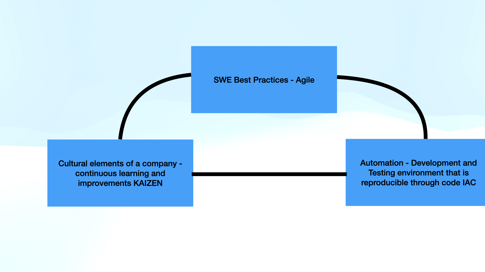

# python-devops

### Purpose

This repo would house the code created while acing `DevOps`.

### Block Diagram - basis of all this

### Create a project scaffold

Project scafolding means (in SWE) creating a temporary structure for your project or setting everything up for your project. Create development environment that is cloud-based:

#### Colab Notebook

More of a requirement when we talk about **Collaboration**.

#### Github CodeSpaces

Build out scaffold:

* Makefile - keep track of complex stuff
* requirements.txt
* Testing - Pytest
* Python Library tools - scripts
* Dockerfile to build containers
* Command-line tools
* Microservices

1. Create a virtualenv: `virtualenv ~/.venv`
2. edit `~/.bashrc`

#### AWS CloudShell
#### AWS Cloud9

### Command-line Tools

### Microservices

### Containerized Continuous Delivery
